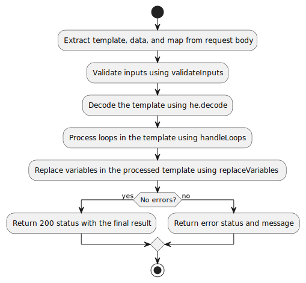
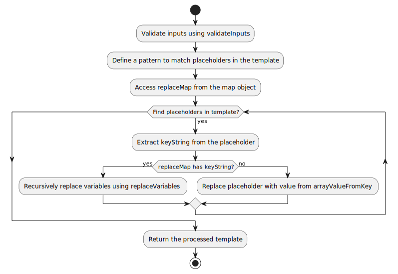

# DocGen API

## Overview
**DocGen API** is a powerful and flexible tool designed to dynamically generate documents based on customizable templates and structured data. With support for nested loops, data mapping, and placeholder substitution, this API simplifies the automation of document creation for various use cases.

---

## Features
- **Dynamic Templates**: Use placeholders (e.g., `<<placeholder>>`) in your templates.
- **Data Mapping**: Replace placeholders with structured JSON data.
- **Nested Loops**: Handle repeating structures, such as lists and interactions.
- **Custom Mappings**: Transform specific fields with predefined rules.
- **Automation**: Generate personalized documents efficiently.

---

## Use Cases
- Generating invoices, reports, or personalized letters.
- Automating document creation from external data sources.
- Simplifying content generation for communication or reporting needs.

---

## Example Workflow

### Input
**Template**:
```plaintext
Name: <<dev.name>> <<[start_loop|dev.contacts]>> - contact by <<dev.contacts.type>>, <<[start_loop|dev.contacts.interactions]>> Data:<<dev.contacts.interactions.date>> - Contato: <<dev.contacts.interactions.contact>> \n <<[end_loop|dev.contacts.interactions]>><<[end_loop|dev.contacts]>>
```

Data:
```json
{
    "data": {
        "dev": {
            "name": "Emerson Udovic",
            "contacts": [
                {
                    "type": "phone",
                    "contact": "xx-981xx-038x",
                    "interactions": [
                        {
                            "date": "2024-12-21 05:31:07",
                            "contact": "Hello!"
                        },
                        {
                            "date": "2024-12-21 05:31:030",
                            "contact": "Go to sleep guy"
                        }
                    ]
                }
            ]
        }
    },
    "template": "Name: <<dev.name>> <<[start_loop|dev.contacts]>> - contact by <<dev.contacts.type>>, <<[start_loop|dev.contacts.interactions]>> Data:<<dev.contacts.interactions.date>> - Contato: <<dev.contacts.interactions.contact>> \n <<[end_loop|dev.contacts.interactions]>><<[end_loop|dev.contacts]>>",
    "map": {
        "replace": {
            "dev.name": "<b><<dev.name>></b>",
            "dev.contacts.interactions.date": "Replaced Date <<dev.contacts.interactions.date>>"
        }
    }
}
```

Output:
```json
{
    "success": true,
    "finalResult": "Name: <b>Emerson Udovic</b>  - contact by phone,  Data:Replaced Date 2024-12-21 05:31:07 - Contato: Hello! \n  Data:Replaced Date 2024-12-21 05:31:030 - Contato: Go to sleep guy \n "
}
```

## API Reference
**Endpoint:** POST /api/document-generate
**Description:** Generates a document by replacing placeholders in a template with provided data.

**Request Body:**
```json
    {
      "template": "Template string with placeholders",
      "data": { "key": "value" },
      "map": { "replace": { "key": "transformation" } }
    }
```

Response:
```json
{
  "success": true,
  "result": "Generated document content"
}

```

## Getting Started
**Requirements**
- Node.js (v18 or later)
- npm

**Installation**
Clone the repository:
```
git clone https://github.com/eudovic/json2docs.git
```
**Navigate to the project directory:**
`cd json2docs`

**Install dependencies:**
`npm install`

**Running the Application**
`npm start`

**Running to DEV the Application**
`npm dev`

Access the API documentation at: http://localhost:3000/api-docs

## Development
**Project Structure**

    src/
    ├── controllers/        # API controllers
    ├── docs/               # Swagger documentation
    ├── routes/             # API routes
    ├── services/           # Core logic (e.g., template processing)
    ├── swagger.js          # Swagger setup
    └── index.js            # Application entry point

## Architecture

### controllers/documentController
**General Workflow**
- **Input:** The client sends a template, data, and map via a POST request.
- **Validation:** The data is validated to ensure consistency.
- **Decoding:** HTML entities in the template are decoded.
- **Loop Processing:** Repetitive structures in the template are replaced based on the provided data.
- **Variable Substitution:** Remaining placeholders are replaced with their corresponding values.
- **Output:** The final processed document is returned to the client in the response



---


### services/replaceVariables
**General Workflow**
1. **Input Validation**: Validate the provided inputs (`template`, `data`, `map`) to ensure they meet the requirements.

2. **Placeholder Pattern Definition**: Define a pattern to identify placeholders in the template (e.g., `<<variable>>`).

3. **Replacement Map Access**: Retrieve the `replaceMap` from the provided map to handle custom replacements.

4. **Placeholder Processing**:
   - Iterate over all placeholders in the template.
   - Extract the `keyString` for each placeholder.
   - Check if the `replaceMap` contains a custom replacement for the `keyString`:
     - **Yes**: Recursively process the replacement using `replaceVariables`.
     - **No**: Substitute the placeholder with the corresponding value from the data, using `arrayValueFromKey`.

5. **Output**: Return the fully processed template with all placeholders replaced.





**Contributing**
Contributions are welcome! Please fork this repository and submit a pull request.

**License**
This project is licensed under the MIT License. See the LICENSE file for details.

**Contact**
For questions or feedback, reach out to:

Name: Emerson Udovic
Email: eudovic3d@gmail.com


